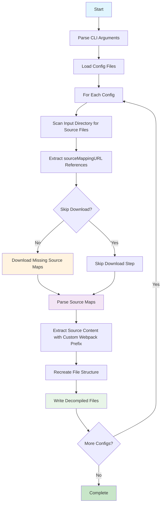

# Webpack Source Decompiler

A TypeScript tool for automatically downloading source maps and decompiling webpack-bundled JavaScript/CSS files from web applications back to their original source code.

## Description

This tool helps reverse engineers and developers analyze webpack-bundled web applications by:

1. **Finding source maps** - Scans downloaded web application files for `sourceMappingURL` references in webpack bundles
2. **Downloading source maps** - Automatically downloads the referenced source map files from the web
3. **Decompiling webpack sources** - Extracts original source code from webpack source maps and recreates the original project structure

The tool specifically handles webpack's bundling patterns, including:

- Webpack module path resolution (`webpack://_N_E/`, `webpack://`)
- Source path normalization and cleanup
- Recreation of original folder structures from bundled code

The tool processes multiple website configurations in parallel, making it efficient for analyzing multiple webpack-based web applications.

## Setup

### Prerequisites

- Node.js (v14 or higher)
- npm or pnpm
- TypeScript

### Installation

1. Clone the repository:

```bash
git clone <repository-url>
cd source-decompiler
```

2. Install dependencies:

```bash
npm install
# or
pnpm install
```

### Configuration

Create configuration files in the `sources/` directory. Each configuration file should be named `*.config.json` and follow this schema:

#### Config Schema

```typescript
interface Config {
  inputDir: string; // Path to downloaded website files
  baseUrl: string; // Base URL of the target website (trailing slash handled automatically)
  baseOutputDir: string; // Output directory for results
  mapsDir: string; // Subdirectory for source maps
  decompiledDir: string; // Subdirectory for decompiled sources
  exts: string[]; // File extensions to process
  webpackPrefix?: string; // Optional webpack prefix for module paths (e.g. "_N_E", "trello-client")
}
```

#### Example Configurations

Create `sources/example.config.json`:

```json
{
  "inputDir": "/Users/username/Downloads/sources/https:/example.com",
  "baseUrl": "https://example.com/",
  "baseOutputDir": "output",
  "mapsDir": "maps",
  "decompiledDir": "decompiled/src",
  "exts": [".js", ".jsx", ".ts", ".tsx", ".mjs", ".cjs", ".css", ".scss"],
  "webpackPrefix": "_N_E"
}
```

For Trello (`sources/trello.config.json`):

```json
{
  "inputDir": "/Users/username/Downloads/sources/https:/trello.com",
  "baseUrl": "https://trello.com/assets",
  "baseOutputDir": "output",
  "mapsDir": "maps",
  "decompiledDir": "decompiled/src",
  "exts": [".js", ".jsx", ".ts", ".tsx", ".mjs", ".cjs", ".css", ".scss"],
  "webpackPrefix": "trello-client"
}
```

### Downloading Website Sources

To get the source files for the `inputDir`, use one of these Chrome extensions:

#### Option 1: Save All Resources

**Extension**: [Save All Resources](https://chromewebstore.google.com/detail/save-all-resources/abpdnfjocnmdomablahdcfnoggeeiedb?hl=en)

1. Install the extension
2. Navigate to the target website
3. Click the extension icon
4. Click "Save All Resources"
5. Choose a download location matching your config's `inputDir`

#### Option 2: DevTools - Sources Downloader

**Extension**: [DevTools - Sources Downloader](https://chromewebstore.google.com/detail/devtools-sources-download/hhfkbeloejjheeiihhjndfcogjhejoek)

1. Install the extension
2. Open Developer Tools (F12)
3. Navigate to the Sources tab
4. Click the extension's download button
5. Save files to your config's `inputDir` location

## How to Run

### Basic Usage

Process all configurations in the `sources/` directory:

```bash
npm start
```

### Specific Configuration Files

Process only specific configuration files using the `--source` argument:

```bash
npm start -- --source trello.config.json
npm start -- --source trello.config.json --source vnuhn.config.json
```

### Skip Download Mode

If you want to skip downloading source maps and only decompile existing maps:

```bash
npm start -- --skip-download
npm start -- --source trello.config.json --skip-download
```

This is useful for:

- Re-running decompilation after manual source map downloads
- Testing configuration changes
- Processing existing source map collections

### CLI Arguments

- `--source <file>`: Specify one or more config files to process (relative to `sources/` directory)
- `--skip-download`: Skip downloading source maps and only decompile existing ones

### Output Structure

The tool creates the following output structure:

```
output/
├── maps/                     # Downloaded source maps
│   ├── app.js.map
│   ├── styles.css.map
│   └── ...
└── decompiled/
    └── src/                  # Decompiled source files
        ├── components/
        │   ├── App.tsx
        │   └── Button.jsx
        ├── styles/
        │   └── main.scss
        └── ...
```

## Workflow Diagram



## Features

- **Webpack Bundle Support**: Specifically designed to handle webpack-bundled applications
- **Configurable Webpack Prefix**: Support for custom webpack prefixes (e.g., "\_N_E", "trello-client") via config
- **CLI Argument Support**: Process specific config files with `--source` and `--skip-download` flags
- **Multi-site Support**: Process multiple website configurations in one run
- **Automatic Discovery**: Finds source map references in JavaScript and CSS files
- **Smart Downloading**: Only downloads missing source maps
- **URL Normalization**: Automatically handles baseUrl with or without trailing slash
- **Structure Preservation**: Maintains original project structure from webpack source maps
- **Webpack Path Resolution**: Handles webpack-specific module paths and normalization
- **Extension Support**: Works with popular Chrome extensions for source downloading
- **Skip Mode**: Option to skip downloads for offline processing

## File Extensions Supported

- JavaScript: `.js`, `.jsx`, `.mjs`, `.cjs`
- TypeScript: `.ts`, `.tsx`
- Stylesheets: `.css`, `.scss`

## Contributing

1. Fork the repository
2. Create a feature branch
3. Make your changes
4. Add tests if applicable
5. Submit a pull request

## License

[Add your license information here]
